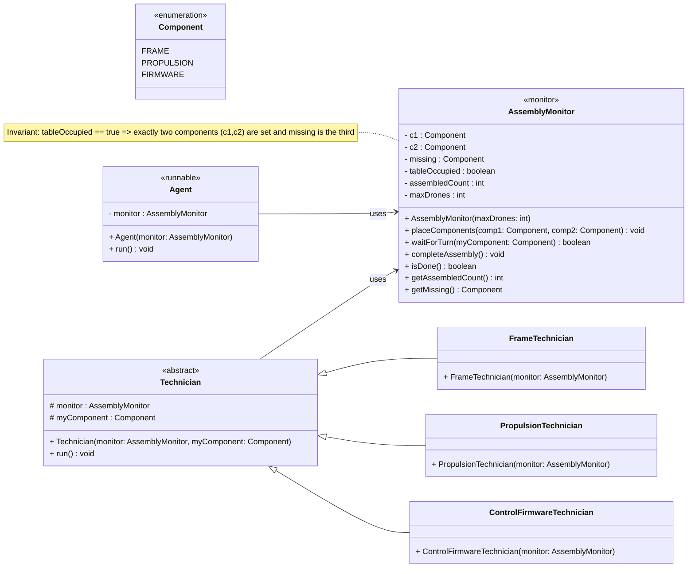
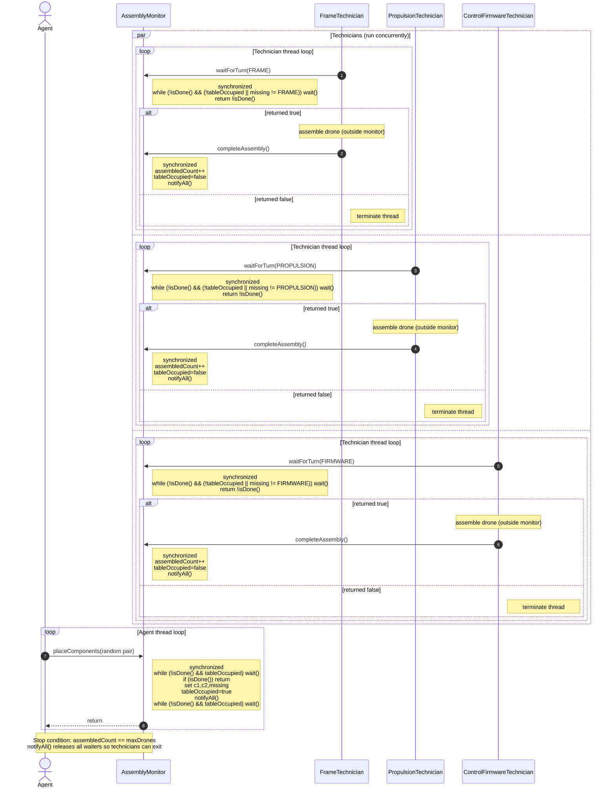

# Autonomous Drone Assembly Line with Java Threads
_SYSC3303W2026 • Assignment 01 • Dr. Sabouni, Rami • Carleton University_

## 1. Problem Context

This assignment is based on the classic **Cigarette Smokers Problem** introduced by S. Patil (1971) as a benchmark synchronization exercise in concurrent programming research [1].

**Agent behavior**:
- Randomly selects **two components** out of `{FRAME, PROPULSION, FIRMWARE}`
- Places them on a **shared table**

**Technician behavior**:
- **Exactly one** of three technicians has the **missing third component**
- That technician **assembles the drone**, signals agent via monitor, increments counter

**Termination**: System stops when **`maxDrones = 20`** autonomous drones assembled.

**Constraints** (per assignment spec):
- **Java intrinsic monitors only**: `synchronized`, `wait()`, `notifyAll()`
- **No** semaphores, busy-waiting, spinning, or sleeping inside synchronized blocks
  *(avoids starvation and lock retention)*

## 2. Design Decisions

### 2.1. Key Decisions

| Aspect | Choice | Rationale |
|--------|--------|-----------|
| **Monitor state** | `tableOccupied`, `missing`, `assembledCount` | Minimal state; avoids multi-flag complexity and reduces race hazards |
| **`waitForTurn() → boolean`** | Returns `!isDone()` | Allows clean technician termination when quota met |
| **Signaling** | `notifyAll()` | Only safe option with Java intrinsic locks (one wait set). Correct technician proceeds via guard conditions |
| **Assembly** | Outside monitor | Prevents long monitor hold times; avoids blocking agent unnecessarily |
| **Termination** | `maxDrones = 20` | Matches assignment specification |

### 2.2. Monitor Invariants
- `tableOccupied == true` → exactly two components (`c1`, `c2`) set; `missing` deterministically identifies the third
- `assembledCount ≤ maxDrones` at all times
- **In each cycle, only one technician** ever passes the guard: `tableOccupied == true AND missing == myComponent`

## 3. Build & Run Instructions

### 3.1. Prerequisites
- IntelliJ IDEA (SYSC 3303 environment)
- Java 17+

### 3.2. Clone and Open
```bash
git clone <your-repo>
cd DroneAssemblyLine
# Open the project in IntelliJ (DroneAssemblyLine.iml)
```
### 3.3. Run
1. Open `DroneAssemblyLine.java`
2. Ensure `MAX_DRONES = 20`
3. Run `main()`

### 3.4. Expected Output
```text
Agent placed: FRAME + PROPULSION (missing FIRMWARE)
ControlFirmwareTechnician completed drone #1
Agent placed: FRAME + FIRMWARE (missing PROPULSION)
PropulsionTechnician completed drone #2
...
All 20 drones assembled. Mission complete!
```

## 4. Project Structure
```text
├── README.md
├── Component.java
├── DroneAssemblyLine.java      # Driver + main()
├── AssemblyMonitor.java        # Core synchronized monitor
├── Agent.java                  # Runnable agent thread
├── Technician.java             # Abstract base
├── FrameTechnician.java        # Concrete technicians...
├── PropulsionTechnician.java
└── ControlFirmwareTechnician.java
```

### 5. Testing & Verification
#### 5.1. Functional Tests
- Count correctness: Exactly 20 assemblies occur
- Correct technician: Only thread with missing component proceeds
- Random selection: Agent produces varied component pairs
- Clean termination: All 4 threads exit gracefully
#### 5.2. Concurrency Tests
- Deadlock-free: Always completes without hanging
- Starvation-free: Every technician gets work across runs
- Low CPU: No busy waiting or spin loops
#### 5.3. Debugging Tips
- Add short-lived System.out.println() inside monitor methods (remove before submission)
- IntelliJ debugger breakpoints on wait() and notifyAll()
- jconsole: Ensure no WAITING threads remain after shutdown

## 6. UML Diagrams
### 6.1. Class Diagram

### 6.2. Sequence Diagram

## Citations
[1] Patil, S. (1971). _"Limitations and Capabilities of Dijkstra's Semaphore Primitives for Coordination Among Processes."_ Project MAC Technical Report, MIT. _(Public domain research reference.)_
