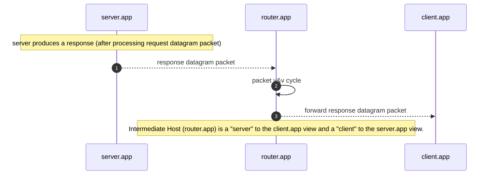
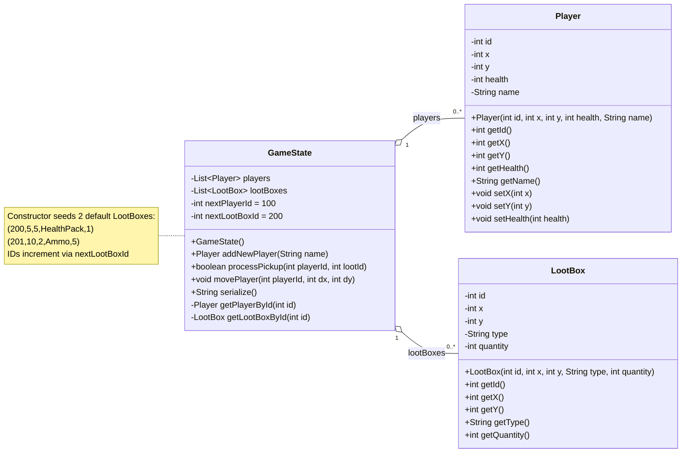
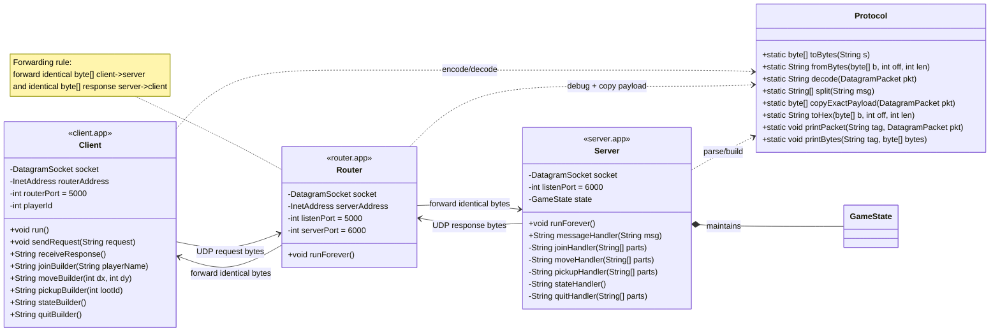
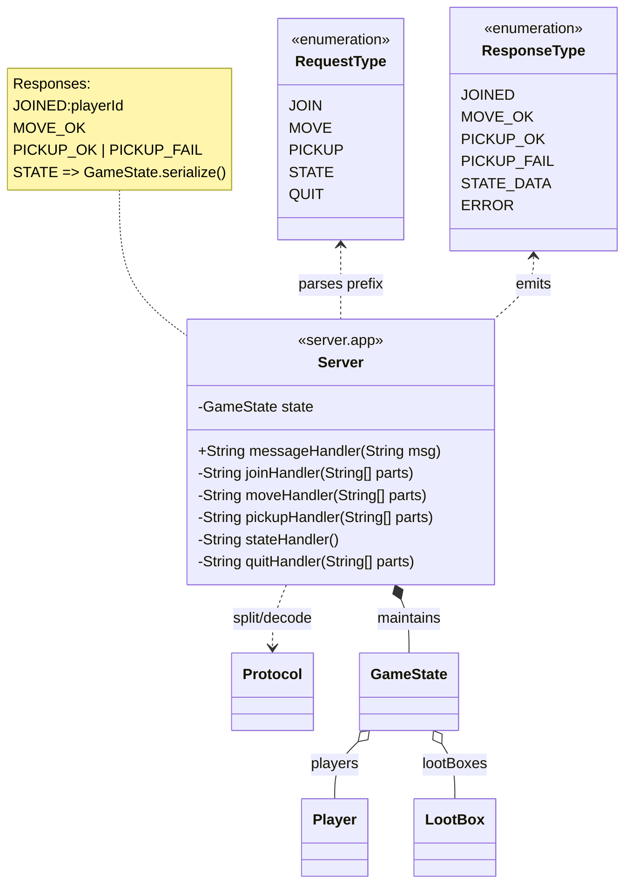

# INTRODUCTION TO UDP
_SYSC3303A • RTConcurrentSys • WINTER2026 • Assignment02_

## 1. Deliverable Requirements (simplified)
- can handle multiple players per session with unique IDs auto-generated and attributed prior to session entry
- 3-component system: `client.app`, `router.app` (the _intermediate host_), `server.app`
- each component-subsystem outputs requests/ responses for auditing purposes
### 1.1. Client Application
- sends gameplay requests (`move || pick-up loot || attack`)
- runs gameplay loop until user quits: _read user input_ → _construct corresponding request_ → _send request to host (`router.app`)_ → _wait for response_
### 1.2. Intermediate Host
- middle relay gateway that manages (v&v) requests/ responses
- runs on loop until shutdown: _wait for request_ → _output request_ → _forward data to target_ → _wait for response_ → _output response_ → _forward to OG client_
### 1.3. Server Application
- processes requests (`update: positions || health || loot availability || inventory`) `&&` sends responses
- maintains a **game state** that tracks:
  - player locations (`x, y`) and health
  - loot types and positions (`x, y`) scattered on game map
- runs a forever loop: _wait for request_ → _parse request_ → _use request data to update game state_ → _construct response_ → _forward response back to OG sender_
### 1.4. Ports
- Router listens on **UDP 5000**
- Server listens on **UDP 6000**
- Client binds to an **ephemeral UDP port**

## 2. File Structure
### 2.1. Recommended layout
```
├── src/
  ├── Client.java
  ├── Router.java
  ├── Server.java
  ├── Protocol.java
  ├── GameState.java
  ├── RequestType.java
  ├── ResponseType.java
├── README.md
├── README.txt
├── README.pdf    # additional report types for redundancy
```
### 2.2. Runnable programs
- `Server.java` (run first)
- `Router.java` (run second)
- `Client.java` (run third)
### 2.3. Helper files
- `GameState.java` (includes `GameState`, `Player`, `LootBox`)
- `Protocol.java` (UTF-8 encode/decode, parsing, debug print, payload copy)
- `RequestType.java`, `ResponseType.java` (enums for request/response tokens)

### 2.4. How to Run (IntelliJ)
1. Open the project in IntelliJ.
2. Ensure all `.java` files are in the same source root (default package).
3. Run programs in this order (each in its own Run configuration / terminal window):
   1) `Server.main()`
   2) `Router.main()`
   3) `Client.main()`

The system runs until you terminate the processes (Client exits on QUIT).
## 3. Diagrams
### 3.1. Sequence Diagrams
#### 3.1.1. Client Request Flow

### 3.2. UML Class Diagrams
#### 3.2.1. Domain Model (Game Environment)

_Based on `GameState.java` file that was provided by Professor Sabouni, Rami for this assignment._
#### 3.2.2. Networking & Protocols

#### 3.2.3. Server - Facing

## 4. Debug Output
Each component prints request/response activity for debugging and grading:
- Client prints requests it sends and responses it receives.
- Router prints what it receives from Client/Server and what it forwards.
- Server prints what it receives and what it sends back.

Sample flow includes JOIN, MOVE, PICKUP, STATE, QUIT with expected responses (JOINED, MOVE_OK, PICKUP_OK, serialized GameState).

## 5. Integration Notes
- The project uses **enums** (`RequestType`, `ResponseType`) internally to avoid hard-coded command strings.
- The wire protocol remains **string-based**: enums are converted to their wire tokens (e.g., `MOVE`, `MOVE_OK`) and then encoded as UTF-8 bytes.
- `Protocol.java` centralizes:
  - UTF-8 encoding/decoding
  - colon-delimited parsing
  - request/response builders
  - byte-for-byte payload copying for Router forwarding
  - hex dump debug utilities
- The Router forwards identical payload bytes using the received packet length to avoid forwarding buffer garbage.
