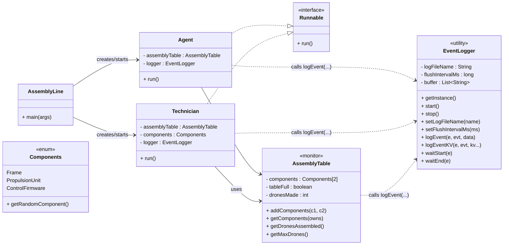
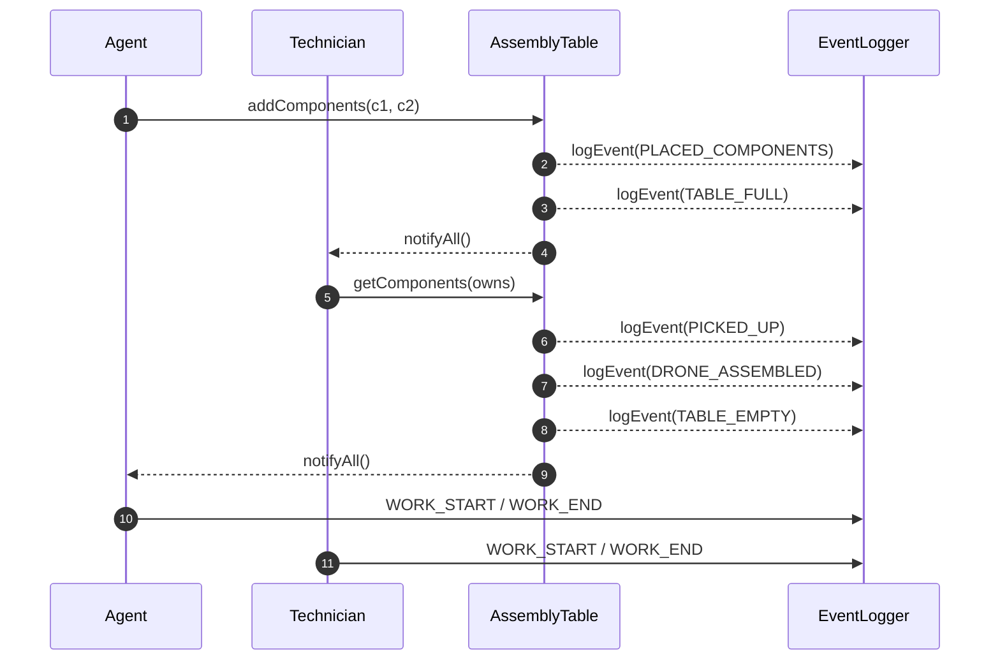
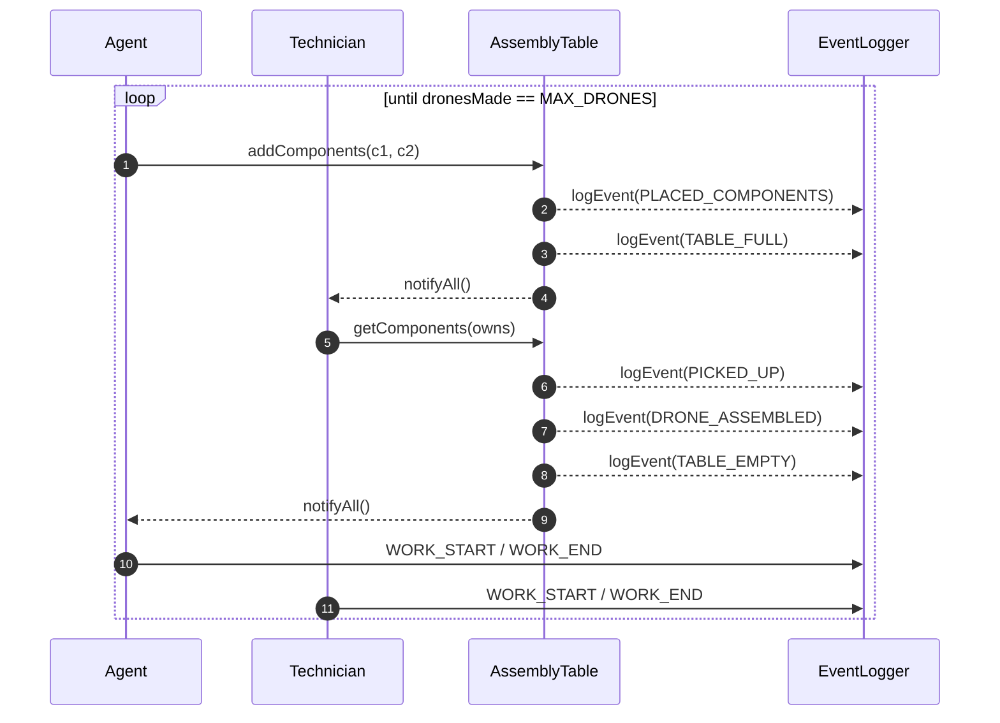

# DRONE ASSEMBLY LINE — LOGGING & METRICS SYSTEM
_SYSC3303A • RTConcurrentSys • WINTER2026 • Assignment04_

## 1. Simplified Deliverable Requirements
The system extends the classic **Agent–Technician–Monitor** drone‑assembly concurrency problem by adding:
- A **daemonized EventLogger** (buffered, asynchronous)
- A **run‑ID log file** per execution (`assembly_log_YYYYMMDD_HHMMSS.txt`)
- A **concurrency‑safe measurement layer** that captures:
    - Wait times (`WAIT_START`, `WAIT_END`)
    - Work durations (`WORK_START`, `WORK_END`)
    - Response times (`RESPONSE_TIME`)
    - Throughput + utilization
- A fully automated **LogAnalyzer** that computes:
    - Total drones assembled
    - Total run time
    - Drones per second
    - Per‑thread waiting time and utilization
    - Average response time

### 1.1. Agent (Producer Thread)
- Randomly selects **two distinct components**
- Requests placement onto `AssemblyTable`
- Logs:
    - `COMPONENTS_SELECTED`
    - `PLACED_COMPONENTS`
    - `COMPONENTS_ADDED`
    - `WORK_START / WORK_END`
    - `RESPONSE_TIME`
    - `THREAD_START / THREAD_END`

### 1.2. Technician (Consumer Thread)
- Each Technician has **infinite supply** of exactly **one** component
- Waits until the *other two* appear on the table
- Logs:
    - `RETRIEVING_COMPONENT`
    - `PICKED_UP`
    - `DRONE_ASSEMBLED`
    - `WORK_START / WORK_END`
    - `RESPONSE_TIME`
    - `THREAD_START / THREAD_END`

### 1.3. AssemblyTable (Monitor)
- Controls synchronized access to:
    - `addComponents(...)` (Agent)
    - `getComponents(...)` (Technicians)
- Emits **true wait markers** exactly at blocking points:
    - `WAIT_START`
    - `WAIT_END`
- Logs:
    - `TABLE_FULL`
    - `TABLE_EMPTY`
    - `READY` (state change notifications)
    - `SYSTEM_START`
    - `SYSTEM_END`
    - `JOB_COMPLETED`

### 1.4. EventLogger (Utility + Daemon)
- Singleton, thread‑safe, buffered
- Runs a **background flusher thread**
- Configurable via:
    - `setLogFileName(...)`
    - `setFlushIntervalMs(...)`
- Writes all log entries to a **run‑ID file**

### 1.5. LogAnalyzer (Standalone Parser)
- Runs automatically after the system ends
- Reads the generated run‑ID log
- Produces a detailed human‑readable `metrics.txt`

***
## 2. File Structure
### 2.1. Recommended Layout
# DRONE ASSEMBLY LINE — LOGGING & METRICS SYSTEM
_SYSC3303A • RTConcurrentSys • WINTER2026 • Assignment04_

## 1. Simplified Deliverable Requirements
The system extends the classic **Agent–Technician–Monitor** drone‑assembly concurrency problem by adding:
- A **daemonized EventLogger** (buffered, asynchronous)
- A **run‑ID log file** per execution (`assembly_log_YYYYMMDD_HHMMSS.txt`)
- A **concurrency‑safe measurement layer** that captures:
  - Wait times (`WAIT_START`, `WAIT_END`)
  - Work durations (`WORK_START`, `WORK_END`)
  - Response times (`RESPONSE_TIME`)
  - Throughput + utilization
- A fully automated **LogAnalyzer** that computes:
  - Total drones assembled
  - Total run time
  - Drones per second
  - Per‑thread waiting time and utilization
  - Average response time

### 1.1. Agent (Producer Thread)
- Randomly selects **two distinct components**
- Requests placement onto `AssemblyTable`
- Logs:
  - `COMPONENTS_SELECTED`
  - `PLACED_COMPONENTS`
  - `COMPONENTS_ADDED`
  - `WORK_START / WORK_END`
  - `RESPONSE_TIME`
  - `THREAD_START / THREAD_END`

### 1.2. Technician (Consumer Thread)
- Each Technician has **infinite supply** of exactly **one** component
- Waits until the *other two* appear on the table
- Logs:
  - `RETRIEVING_COMPONENT`
  - `PICKED_UP`
  - `DRONE_ASSEMBLED`
  - `WORK_START / WORK_END`
  - `RESPONSE_TIME`
  - `THREAD_START / THREAD_END`

### 1.3. AssemblyTable (Monitor)
- Controls synchronized access to:
  - `addComponents(...)` (Agent)
  - `getComponents(...)` (Technicians)
- Emits **true wait markers** exactly at blocking points:
  - `WAIT_START`
  - `WAIT_END`
- Logs:
  - `TABLE_FULL`
  - `TABLE_EMPTY`
  - `READY` (state change notifications)
  - `SYSTEM_START`
  - `SYSTEM_END`
  - `JOB_COMPLETED`

### 1.4. EventLogger (Utility + Daemon)
- Singleton, thread‑safe, buffered
- Runs a **background flusher thread**
- Configurable via:
  - `setLogFileName(...)`
  - `setFlushIntervalMs(...)`
- Writes all log entries to a **run‑ID file**

### 1.5. LogAnalyzer (Standalone Parser)
- Runs automatically after the system ends
- Reads the generated run‑ID log
- Produces a detailed human‑readable `metrics.txt`

***
## 2. File Structure
### 2.1. Recommended Layout
    assignment04/
    ├── Agent.java
    ├── AssemblyTable.java
    ├── Components.java
    ├── EventLogger.java
    ├── LogAnalyzer.java
    ├── Technician.java
    │
    ├── umlDiagrams/
    │   ├── UML_Class_Diagram.png
    │   ├── UML_Sequence_Diagram_No_Loop.png
    │   ├── UML_Sequence_Diagram_With_Loop.png
    │
    ├── documentation/
    │   ├── README.html
    │   ├── README_extended.html
    │   ├── README_concise.html
    │   ├── README.md
    │   ├── README.txt
    │
    ├── metrics.txt              # auto-generated after run
    └── assembly_log_*.txt       # run‑ID logs generated per execution
### 2.2. Primary Executables
Run in this order:
1.  `AssemblyTable.main()`
- Spawns Agent + 3 Technicians
- Starts EventLogger
- Orchestrates the entire system
2.  `LogAnalyzer.main()`
- **Automatically called** at the end of execution
- Generates metrics summary + `metrics.txt`

***
## 3. How to Run (IntelliJ)
1.  Open project → ensure SDK = **Java 8+**
2.  Run **`AssemblyTable.main()`**
3.  Wait until:
  - All threads finish
  - Logger flushes and shuts down
  - `LogAnalyzer` executes
4.  Open produced files:
  - `assembly_log_YYYYMMDD_HHMMSS.txt`
  - `metrics.txt`

***
## 4. Diagrams
## 4.1. UML Class Diagram
### 4.1.1 Drone Assembly (Concurrency + Logging)

## 4.2. Sequence Diagrams
### 4.2.1 Single Assembly Cycle (No Loop)

### 4.2.2 One Assembly Cycle (Looped Notation)

***
## 5. Logging Format
Every entry follows:

    Event log: [yyyy-MM-dd HH:mm:ss.SSS , ENTITY , EVENT_CODE , key=value; key=value ...]

**Examples**:

    Event log: [2026-03-14 17:04:22.119 , Agent , PLACED_COMPONENTS , components=[Frame,ControlFirmware]; drones=11]
    Event log: [2026-03-14 17:04:22.892 , Technician-Frame , DRONE_ASSEMBLED , drones=12]

***
## 6. Metrics Output (metrics.txt)
Generated automatically by `LogAnalyzer`:
- Total drones assembled
- Total time (s)
- Throughput (drones/s)
- For **each** Agent/Technician:
  - Total active time
  - Waiting time
  - Utilization = busy / total
  - Average response time (ms)

Example excerpt:

    ===== METRICS ANALYSIS =====
    Total drones assembled: 20
    Total time: 8.542 s
    Throughput: 2.342 drones/s

    Per-thread metrics:
    -------------------------------------
    Thread: Agent
    Total time: 8.541 s
    Total waiting: 1.222 s
    Utilization: 0.856
    Average response time: 421.5 ms

***
## 7. Integration Notes
- **Wait markers** generated only where real `wait()` occurs → accurate utilization.
- **Simulated work** wrapped in `WORK_START / WORK_END`.
- **logEventKV** used for structured metadata (`duration`, `components`, `drones`).
- **daemon thread** ensures flusher does not block application exit.
- **run‑ID log filenames** avoids overwriting previous data.

***
## 8. Submission Artifacts
Include the following:
- Source files (`.java`)
- `documentation\README.txt`
- `documentation\README.md`
- `documentation\README.pdf`
- `umlDiagrams\MaxDrone_Looped_SequenceDiagram.png`
- `umlDiagrams\SingleRun_SequenceDiagram.png`
- `umlDiagrams\UML_Class_Diagram.png`
### 2.2. Primary Executables
Run in this order:
1.  `AssemblyTable.main()`
   - Spawns Agent + 3 Technicians
   - Starts EventLogger
   - Orchestrates the entire system
2.  `LogAnalyzer.main()`
   - **Automatically called** at the end of execution
   - Generates metrics summary + `metrics.txt`

***
## 3. How to Run (IntelliJ)
1.  Open project → ensure SDK = **Java 8+**
2.  Run **`AssemblyTable.main()`**
3.  Wait until:
    - All threads finish
    - Logger flushes and shuts down
    - `LogAnalyzer` executes
4.  Open produced files:
    - `assembly_log_YYYYMMDD_HHMMSS.txt`
    - `metrics.txt`

***
## 4. Diagrams
## 4.1. UML Class Diagram
### 4.1.1 Drone Assembly (Concurrency + Logging)

## 4.2. Sequence Diagrams
### 4.2.1 Single Assembly Cycle (No Loop)

### 4.2.2 One Assembly Cycle (Looped Notation)

***
## 5. Logging Format
Every entry follows:

    Event log: [yyyy-MM-dd HH:mm:ss.SSS , ENTITY , EVENT_CODE , key=value; key=value ...]

**Examples**:

    Event log: [2026-03-14 17:04:22.119 , Agent , PLACED_COMPONENTS , components=[Frame,ControlFirmware]; drones=11]
    Event log: [2026-03-14 17:04:22.892 , Technician-Frame , DRONE_ASSEMBLED , drones=12]

***
## 6. Metrics Output (metrics.txt)
Generated automatically by `LogAnalyzer`:
- Total drones assembled
- Total time (s)
- Throughput (drones/s)
- For **each** Agent/Technician:
    - Total active time
    - Waiting time
    - Utilization = busy / total
    - Average response time (ms)

Example excerpt:

    ===== METRICS ANALYSIS =====
    Total drones assembled: 20
    Total time: 8.542 s
    Throughput: 2.342 drones/s

    Per-thread metrics:
    -------------------------------------
    Thread: Agent
    Total time: 8.541 s
    Total waiting: 1.222 s
    Utilization: 0.856
    Average response time: 421.5 ms

***
## 7. Integration Notes
- **Wait markers** generated only where real `wait()` occurs → accurate utilization.
- **Simulated work** wrapped in `WORK_START / WORK_END`.
- **logEventKV** used for structured metadata (`duration`, `components`, `drones`).
- **daemon thread** ensures flusher does not block application exit.
- **run‑ID log filenames** avoids overwriting previous data.

***
## 8. Submission Artifacts
Include the following:
- Source files (`.java`)
- `documentation\README.txt`
- `documentation\README.md`
- `documentation\README.pdf`
- `umlDiagrams\MaxDrone_Looped_SequenceDiagram.png`
- `umlDiagrams\SingleRun_SequenceDiagram.png`
- `umlDiagrams\UML_Class_Diagram.png`