# Rate Monotonic Scheduling
_SYSC3303W2026 • Assignment 05 • Dr. Sabouni, Rami • Carleton University_

The analysis assumes a single‑processor, fully preemptive system with periodic tasks released synchronously at $t = 0$, deadlines equal to periods, zero scheduling overhead, and no resource sharing or blocking.

Time units are abstract scheduling units; idle intervals are shown explicitly.

## System 01
### Task set
| Process | Period | C | RMS Priority |
| ------- | ------ | - | ------------ |
| P1      | 8      | 3 | Highest (H)  |
| P2      | 12     | 4 | Middle (M)   |
| P3      | 20     | 3 | Lowest (L)   |
### Timeline construction
| Time Interval | Task | Reason                    |
| ------------- | ---- | ------------------------- |
| 0–3           |  P1  | Highest priority          |
| 3–7           |  P2  | Next highest, P1 complete |
| 7–8           |  P3  | Only ready task           |
| 8–11          |  P1  | New P1 release at t=8     |
| 11–12         |  P3  | Resumes                   |
| 12–16         |  P2  | New P2 release            |
| 16–19         |  P1  | New P1 release            |
| 19–20         |  P3  | Finishes                  |

```mermaid
gantt
    title RMS Timing Diagram – Question 1
    dateFormat  s
    axisFormat  %S

    section P1 (T=8)
    P1_1 :0, 3
    IDLE: 3, 8
    P1_2 :8, 11
    IDLE: 11, 16
    P1_3 :16, 19

    section P2 (T=12)
    IDLE: 0, 3
    P2_1 :3, 7
    IDLE: 7, 12
    P2_2 :12, 16

    section P3 (T=20)
    IDLE: 0, 7
    P3_1 :7, 8
    IDLE: 8, 11
    P3_2 :11, 12
    IDLE: 12, 19
    P3_3 :19, 20
```

### Deadline Check
| Process | Deadline  | Completion |
| ------- | --------- | ---------- |
| P1      | 8, 16, 24 | 3, 11, 19  |
| P2      | 12, 24    | 7, 16      |
| P3      | 20        | 20         |

**All deadlines met**.

## System 02
#### Task Set
| Process | Period | C  | RMS Priority |
| ------- | ------ | -- | ------------ |
| P5      | 5      | 1  | Highest (H)  |
| P6      | 25     | 10 | Middle (M)   |
| P4      | 100    | 15 | Lowest (L)   |
### Processor Utilization
Utilization per process:
- $$U_5 = 1 / 5 = 0.2000$$
- $$U_6 = 10 / 25 = 0.4000$$
- $$U_4 = 15 / 100 = 0.1500$$

$$U_{total} = \sum \frac{C_i}{T_i} = 0.2000 + 0.4000 + 0.1500 = 0.7500$$
### Will Deadlines Be Met?
#### Liu–Layland bound for 3 tasks
$$U_{LL} = 3(2^{1/3} - 1) \approx 0.779$$

$$U_{total} = 0.7500 < 0.779$$

The task set **passes** the utilization test ∴ **all deadlines are guaranteed to be met under RMS**.
### Timeline Construction
| Time Interval | Task | Reason                      |
|---------------|------|-----------------------------|
| 0–1           |  P5  | Highest priority (T = 5)    |
| 1–5           |  P6  | Next highest priority       |
| 5–6           |  P5  | Periodic release at t = 5   |
| 6–10          |  P6  | Resumes execution           |
| 10–11         |  P5  | Periodic release at t = 10  |
| 11–15         |  P6  | Resumes execution           |
| 15–16         |  P5  | Periodic release at t = 15  |
| 16–20         |  P6  | Resumes execution           |
| 20–21         |  P5  | Periodic release at t = 20  |
| 21–25         |  P6  | Completes execution         |
| 25–26         |  P5  | Periodic release at t = 25  |
| 26–30         |  P4  | Lowest priority task begins |
| 30–31         |  P5  | Periodic release at t = 30  |
| 31–35         |  P4  | Resumes execution           |
| 35–36         |  P5  | Periodic release at t = 35  |
| 36–40         |  P4  | Completes execution         |

```mermaid
gantt
    title RMS Timing Diagram – Question 2(c)
    dateFormat  s
    axisFormat  %S

    section P5 (T=5)
    P5_1 :0, 1
    IDLE  :1, 5
    P5_2 :5, 6
    IDLE  :6, 10
    P5_3 :10, 11
    IDLE  :11, 15
    P5_4 :15, 16
    IDLE  :16, 20
    P5_5 :20, 21
    IDLE  :21, 25
    P5_6 :25, 26
    IDLE  :26, 30
    P5_7 :30, 31
    IDLE  :31, 35
    P5_8 :35, 36
    IDLE  :36, 40

    section P6 (T=25)
    IDLE  :0, 1
    P6_1 :1, 25
    IDLE  :25, 40

    section P4 (T=100)
    IDLE  :0, 25
    P4_1 :25, 40
```

#### Deadline Check
| Process | Period |  Deadline(s)  | Completion Time(s) | Deadline Met? |
|---------|--------|---------------|--------------------|---------------|
|   P5    |   5    | 5, 10, 15, …  |   1, 6, 11, 16, …  |      Yes      |
|   P6    |   25   |       25      |         25         |      Yes      |
|   P4    |  100   |      100      |         40         |      Yes      |

**All deadlines met**.

## System 03
### Task Set
| Process | Period | C  | RMS Priority |
| ------- | ------ | -- | ------------ |
| P9      | 20     | 5  | Highest (H)  |
| P8      | 40     | 10 | Middle (M)   |
| P7      | 70     | 30 | Lowest (L)   |
### Utilization Test Limits
$$U = 30/70 + 10/40 + 5/20 = 0.4286 + 0.2500 + 0.2500 = \boxed{0.9286}$$

Liu–Layland bound for 3 tasks ≈ **0.779** ∴ fails utilization test but LL test is **sufficient, not necessary**.
#### Timeline Construction
| Time Interval | Task | Reason           |
| ------------- | ---- | ---------------- |
| 0–5           | P9   | Highest priority |
| 5–15          | P8   | Next highest     |
| 15–20         | P7   | Lowest           |
| 20–25         | P9   | New release      |
| 25–35         | P7   | Resumes          |
| 35–40         | Idle | No jobs          |
| 40–45         | P9   | New release      |
| 45–55         | P8   | New release      |
| 55–70         | P7   | Finishes         |

```mermaid
gantt
    title RMS Timing Diagram – Question 3
    dateFormat  s
    axisFormat  %S

    section P9 (T=20)
    P9_1 :0, 5
    IDLE :5, 20
    P9_2 :20, 25
    IDLE :25, 40
    P9_3 :40, 45
    IDLE :45, 70

    section P8 (T=40)
    IDLE :0, 5
    P8_1 :5, 15
    IDLE :15, 45
    P8_2 :45, 55
    IDLE :55, 70

    section P7 (T=70)
    IDLE :0, 15
    P7_1 :15, 35
    IDLE :35, 55
    P7_2 :55, 70
```

#### Deadline Check
| Process | Deadline   | Completion |
| ------- | ---------- | ---------- |
| P9      | 20, 40, 60 | 5, 25, 45  |
| P8      | 40, 80     | 15, 55     |
| P7      | 70         | 70         |

**All deadlines met** despite **failing LL bound**.
