# Rate Monotonic Scheduling
_SYSC3303 • A6W2026 • Assignment 05 • Dr. Sabouni, Rami • Carleton University_

**Student**: Lavji, Fareen 
**Student Number**: xxxxxx543

_The analysis assumes a single‑processor, fully preemptive system with periodic tasks released synchronously at t = 0, deadlines equal to periods, zero scheduling overhead, and no resource sharing or blocking._ 
_Time units are abstract scheduling units; idle intervals are shown explicitly._

## System 01
### Task set
| Process | Period | C | RMS Priority |
| ------- | ------ | - | ------------ |
| P1      | 8      | 3 | Highest (H)  |
| P2      | 12     | 4 | Middle (M)   |
| P3      | 20     | 3 | Lowest (L)   |
### Timeline construction
| Time Interval | Task | Reason                    |
| ------------- | ---- | ------------------------- |
| 0–3           |  P1  | Highest priority          |
| 3–7           |  P2  | Next highest, P1 complete |
| 7–8           |  P3  | Only ready task           |
| 8–11          |  P1  | New P1 release at t=8     |
| 11–12         |  P3  | Resumes                   |
| 12–16         |  P2  | New P2 release            |
| 16–19         |  P1  | New P1 release            |
| 19–20         |  P3  | Finishes                  |

```mermaid
gantt
    title RMS Timing Diagram – Question 1
    dateFormat  s
    axisFormat  %S

    section Process 1 (T=8)
    P1: 0, 3
    IDLE: 3, 8
    P1: 8, 11
    IDLE: 11, 16
    P1: 16, 19

    section Process 2 (T=12)
    P2: 3, 7
    IDLE: 7, 12
    P2: 12, 16

    section Process 3 (T=20)
    P3: 7, 8
    IDLE: 8, 11
    P3: 11, 12
    IDLE: 12, 19
    P3: 19, 20
```

### Deadline Check
| Process | Deadline  | Completion | Deadlines Met? |
| ------- | --------- | ---------- | -------------- |
| P1      | 8, 16, 24 | 3, 11, 19  |       Yes      |
| P2      | 12, 24    | 7, 16      |       Yes      |
| P3      | 20        | 20         |       Yes      |

**All deadlines met**.

---
## System 02
#### Task Set
| Process | Period | C  | RMS Priority |
| ------- | ------ | -- | ------------ |
| P5      | 5      | 1  | Highest (H)  |
| P6      | 25     | 10 | Middle (M)   |
| P4      | 100    | 15 | Lowest (L)   |
### Processor Utilization
Utilization per process: 
- $U_5 = \frac{1}{5} = 0.2000$
- $U_6 = \frac{10}{25} = 0.4000$
- $U_4 = \frac{15}{100} = 0.1500$

Total Utilization:

$$U_{total} = \sum \frac{C_i}{T_i} = 0.2000 + 0.4000 + 0.1500 = 0.7500$$

### Will Deadlines Be Met?
#### Liu–Layland bound for 3 tasks
$$U_{LL} = 3(2^{1/3} - 1) \approx 0.779$$
$$U_{total} = 0.7500 < 0.779$$

The task set **passes** the utilization test therefore **all deadlines are guaranteed to be met under RMS**.
### Timeline Construction
| Time Interval | Task | Reason                      |
|---------------|------|-----------------------------|
| 0–1           |  P5  | Highest priority (T = 5)    |
| 1–5           |  P6  | Next highest priority       |
| 5–6           |  P5  | Periodic release at t = 5   |
| 6–10          |  P6  | Resumes execution           |
| 10–11         |  P5  | Periodic release at t = 10  |
| 11–15         |  P6  | Resumes execution           |
| 15–16         |  P5  | Periodic release at t = 15  |
| 16–20         |  P6  | Resumes execution           |
| 20–21         |  P5  | Periodic release at t = 20  |
| 21–25         |  P6  | Completes execution         |
| 25–26         |  P5  | Periodic release at t = 25  |
| 26–30         |  P4  | Lowest priority task begins |
| 30–31         |  P5  | Periodic release at t = 30  |
| 31–35         |  P4  | Resumes execution           |
| 35–36         |  P5  | Periodic release at t = 35  |
| 36–40         |  P4  | Completes execution         |

```mermaid
gantt
    title RMS Timing Diagram – Question 2(c)
    dateFormat  s
    axisFormat  %S

    section Process 5 (T=5)
    P5: 0, 1
    IDLE: 1, 5
    P5: 5, 6
    IDLE: 6, 10
    P5: 10, 11
    IDLE: 11, 15
    P5: 15, 16
    IDLE: 16, 20
    P5: 20, 21
    IDLE: 21, 25
    P5: 25, 26
    IDLE: 26, 30
    P5: 30, 31
    IDLE: 31, 35
    P5: 35, 36

    section Process 6 (T=25)
    P6: 1, 5
    IDLE: 5, 6
    P6: 6, 10
    IDLE: 10, 11
    P6: 11, 15
    IDLE: 15, 16
    P6: 16, 20
    IDLE: 20, 21
    P6: 21, 25

    section Process 4 (T=100)
    P4: 26, 30
    IDLE: 30, 31
    P4: 31, 35
    IDLE: 35, 36
    P4: 36, 40
```

#### Deadline Check
| Process | Period |  Deadline(s)  | Completion Time(s) | Deadline Met? |
|---------|--------|---------------|--------------------|---------------|
|   P5    |   5    | 5, 10, 15, …  |   1, 6, 11, 16, …  |      Yes      |
|   P6    |   25   |       25      |         25         |      Yes      |
|   P4    |  100   |      100      |         40         |      Yes      |

**All deadlines met**.

---
## System 03
### Task Set
| Process | Period | C  | RMS Priority |
| ------- | ------ | -- | ------------ |
| P9      | 20     | 5  | Highest (H)  |
| P8      | 40     | 10 | Middle (M)   |
| P7      | 70     | 30 | Lowest (L)   |
### Utilization Test Limits
$$U = \frac{30}{70} + \frac{10}{40} + \frac{5}{20} = 0.4286 + 0.2500 + 0.2500 = \boxed{0.9286}$$

Liu–Layland bound for 3 tasks ≈ **0.779** therefore fails utilization test but the LL test is **sufficient, not necessary**.
#### Timeline Construction
| Time Interval | Task | Reason           |
| ------------- | ---- | ---------------- |
| 0–5           | P9   | Highest priority |
| 5–15          | P8   | Next highest     |
| 15–20         | P7   | Lowest           |
| 20–25         | P9   | New release      |
| 25–35         | P7   | Resumes          |
| 35–40         | Idle | No jobs          |
| 40–45         | P9   | New release      |
| 45–55         | P8   | New release      |
| 55–70         | P7   | Finishes         |

```mermaid
gantt
    title RMS Timing Diagram – Question 3
    dateFormat  s
    axisFormat  %S

    section Process 9 (T=20)
    P9: 0, 5
    IDLE: 5, 20
    P9: 20, 25
    IDLE: 25, 40
    P9: 40, 45
    IDLE: 45, 70

    section Process 8 (T=40)
    P8: 5, 15
    IDLE: 15, 45
    P8: 45, 55
    IDLE: 55, 70

    section Process 7 (T=70)
    P7: 15, 20
    IDLE: 20, 25
    P7: 25, 35
    IDLE: 35, 55
    P7: 55, 70
```

#### Deadline Check
| Process | Deadline   | Completion | Deadlines Met ? |
| ------- | ---------- | ---------- | --------------- |
| P9      | 20, 40, 60 | 5, 25, 45  |       Yes       |
| P8      | 40, 80     | 15, 55     |       Yes       |
| P7      | 70         | 70         |       Yes       |

**All deadlines met** despite **failing LL bound**.

## Generalized Utilization Bound Theorem (GUBT)
| Task | Period (Tᵢ) | Execution Time (Cᵢ) |
|------|-------------|---------------------|
| T1   | 108         | 12                  |
| T2   | 125         | 30                  |
| T3   | 175         | 25                  |
| T4   | 290         | 35                  |
| Ta   | 200         | 10                  |
### Task Set and Priority Order
Tasks **T1–T4** are scheduled using **Rate Monotonic Scheduling (RMS)** (shorter period ⇒ higher priority). 
Task **Ta** has the **highest priority** and is ​**not scheduled using RMS**​. 
Priority order: ${Ta} > {T1} > {T2} > {T3} > {T4}$
### Generalized Utilization Bound Theorem (Formal Equations)
For a task T_i with period T_i and execution time C_i:
- **Factor 1**: Interference from higher‑priority tasks with shorter periods → $I_i^{(1)} = \sum_{j \in hp_s(i)} \frac{C_j}{T_i}$
- **Factor 2**: Task’s own execution utilization → $I_i^{(2)} = U_i = \frac{C_i}{T_i}$
- **Factor 3**: Interference from higher‑priority tasks with longer periods (once) → $I_i^{(3)} = \sum_{j \in hp_l(i)} \frac{C_j}{T_i}$
- **Factor 4**: Blocking by lower‑priority tasks → $I_i^{(4)} = \frac{\max\limits_{k \in lp(i)} C_k}{T_i}$
- **Total Utilization / Interference for Task Ti** → $I_i = I_i^{(1)} + I_i^{(2)} + I_i^{(3)} + I_i^{(4)}$
- **Schedulability Condition** → $I_i \le 1$

**Notation**:

$$
\begin{aligned}
hp_s(i) &: \text{ higher‑priority tasks with } T_j < T_i \\
hp_l(i) &: \text{ higher‑priority tasks with } T_j \ge T_i \\
lp(i) &: \text{ lower‑priority tasks than } T_i
\end{aligned}
$$

### Computed Factors and Total Utilization
|  Task  | Factor 1 | Factor 2 | Factor 3 | Factor 4 | **Total Util** |
| ------ | -------- | -------- | -------- | -------- | -------------- |
| **Ta** |  0.0000  |  0.0500  |  0.0000  |  0.0000  |   **0.0500**   |
| **T1** |  0.0000  |  0.1111  |  0.0926  |  0.3241  |   **0.5278**   |
| **T2** |  0.0960  |  0.2400  |  0.0800  |  0.2800  |   **0.6960**   |
| **T3** |  0.2400  |  0.1429  |  0.0571  |  0.2000  |   **0.6400**   |
| **T4** |  0.2310  |  0.1207  |  0.0000  |  0.0000  |   **0.3517**   |
### Schedulability Result
- **Schedulable under GUBT**: Ta, T1
- **Not schedulable under GUBT**: T2, T3, T4

Although Tasks **T2, T3, and T4** have total utilization values less than 1, they are considered **not schedulable** due to the **pessimistic blocking term (Factor 4)** imposed by lower‑priority tasks.
