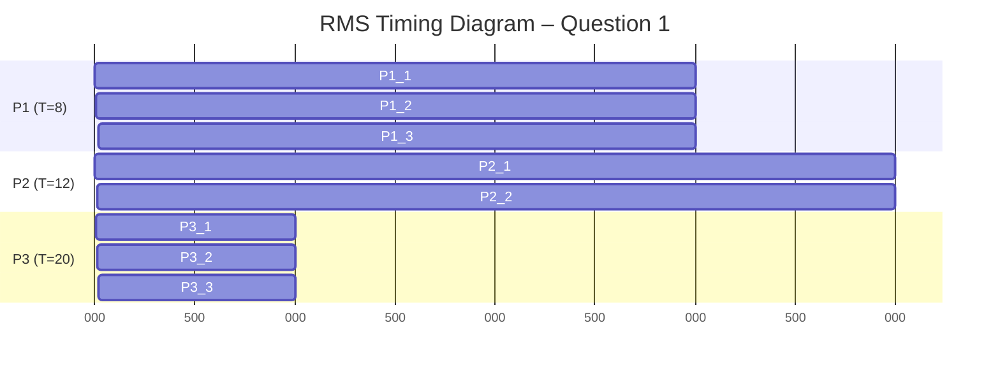
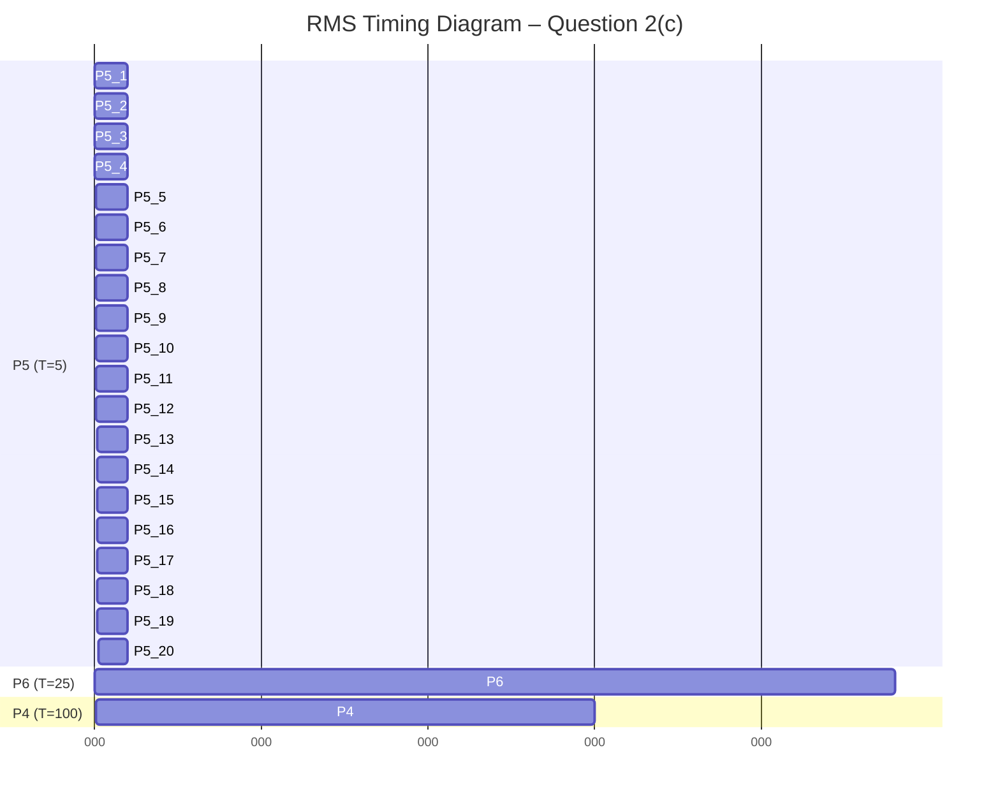
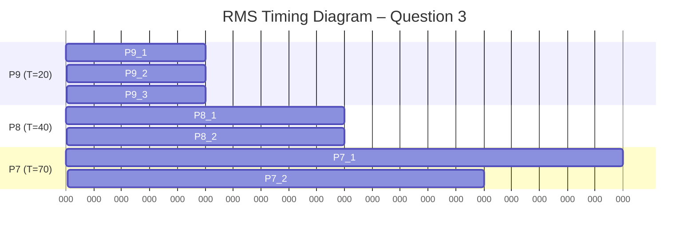

# SYSC 3303A – Assignment 5
## Rate Monotonic Scheduling – Mermaid Diagrams

```mermaid
gantt
    title RMS Timing Diagram – Question 1
    dateFormat  X
    axisFormat  %L

    section P1 (T=8)
    P1_1 :0, 3
    P1_2 :8, 3
    P1_3 :16, 3

    section P2 (T=12)
    P2_1 :3, 4
    P2_2 :12, 4

    section P3 (T=20)
    P3_1 :7, 1
    P3_2 :11,1
    P3_3 :19,1
```

```mermaid
gantt
    title RMS Timing Diagram – Question 2(c)
    dateFormat  X
    axisFormat  %L

    section P5 (T=5)
    P5_1 :0, 1
    P5_2 :5, 1
    P5_3 :10,1
    P5_4 :15,1
    P5_5 :20,1
    P5_6 :25,1
    P5_7 :30,1
    P5_8 :35,1
    P5_9 :40,1
    P5_10 :45,1
    P5_11 :50,1
    P5_12 :55,1
    P5_13 :60,1
    P5_14 :65,1
    P5_15 :70,1
    P5_16 :75,1
    P5_17 :80,1
    P5_18 :85,1
    P5_19 :90,1
    P5_20 :95,1

    section P6 (T=25)
    P6 :1, 24

    section P4 (T=100)
    P4 :25, 15
```

```mermaid
gantt
    title RMS Timing Diagram – Question 3
    dateFormat  X
    axisFormat  %L

    section P9 (T=20)
    P9_1 :0, 5
    P9_2 :20,5
    P9_3 :40,5

    section P8 (T=40)
    P8_1 :5, 10
    P8_2 :45,10

    section P7 (T=70)
    P7_1 :15,20
    P7_2 :55,15
```
