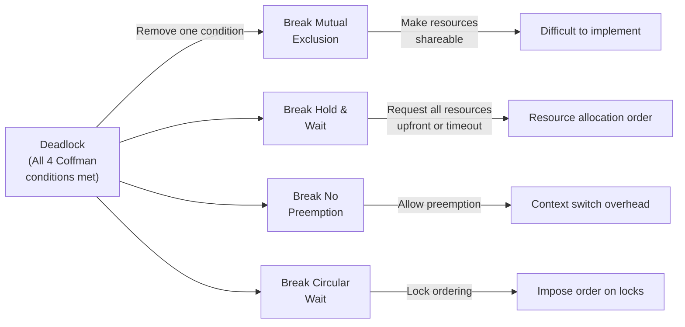
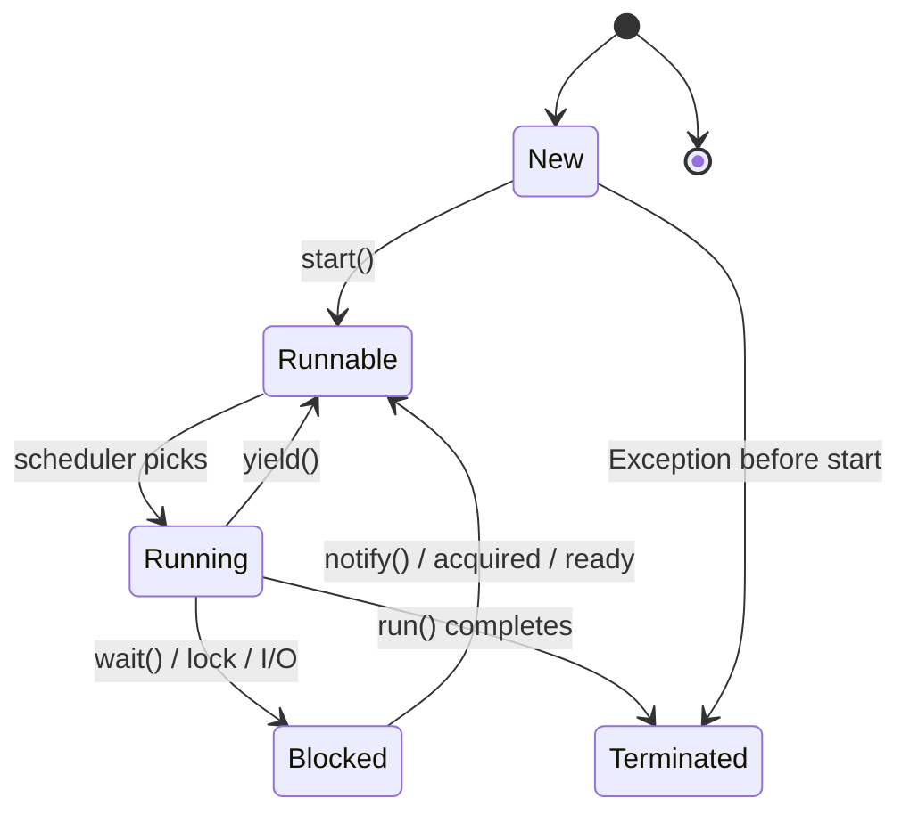
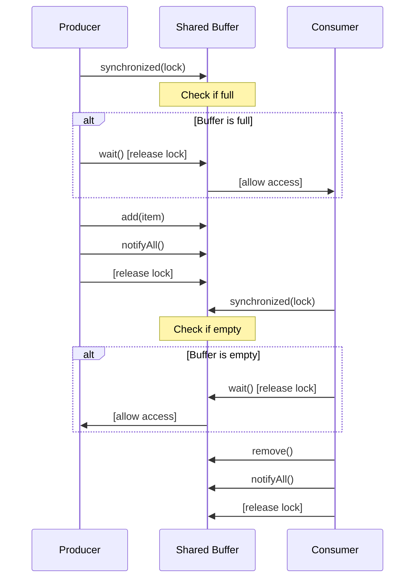
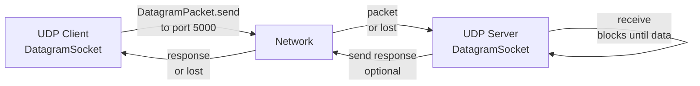
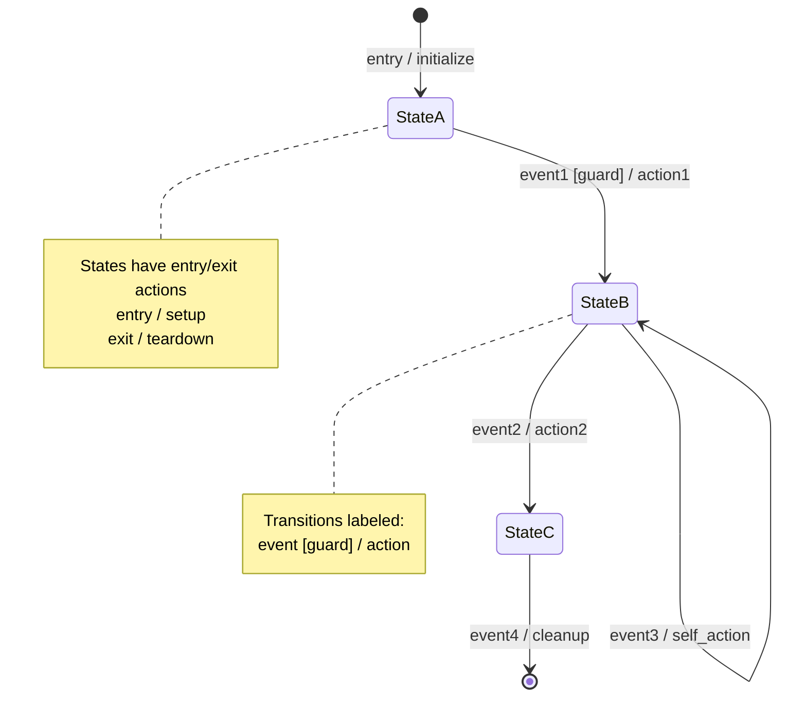
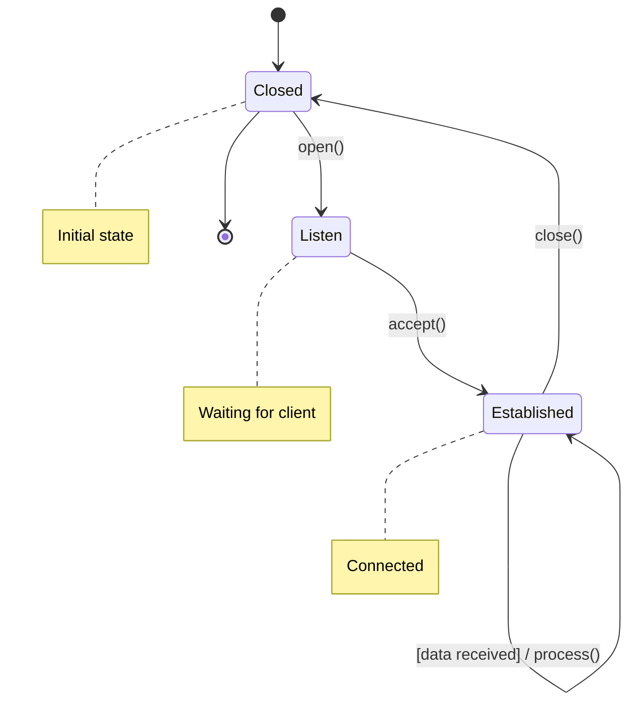
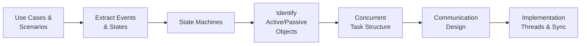
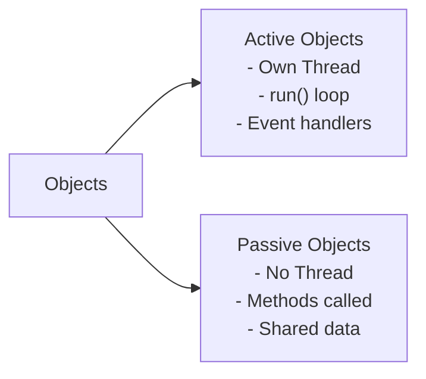
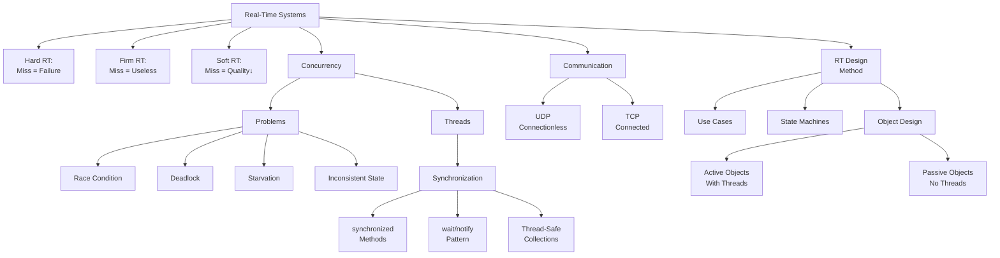
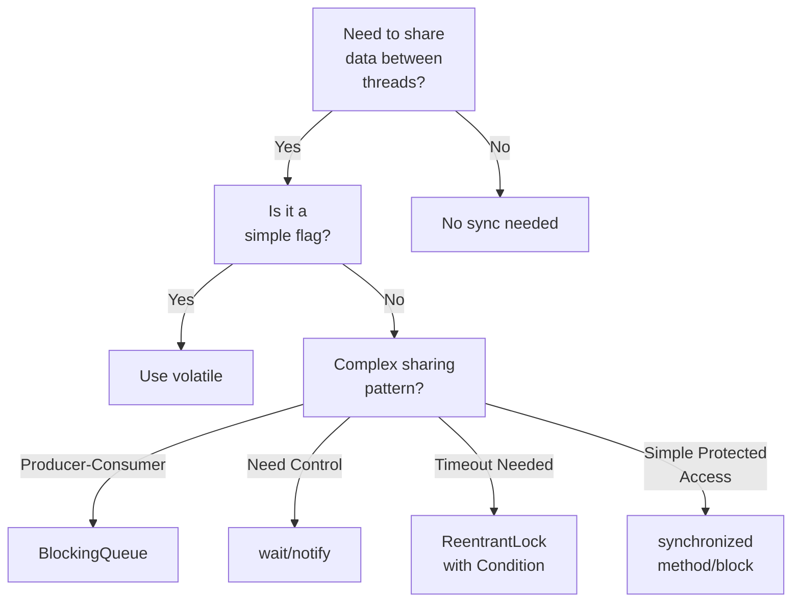

# REAL‑TIME CONCURRENT SYSTEMS - MIDTERM CRIB SHEET
_SYSC3303AW26 • Dr. Sabouni, Rami • up to Feb 13 – Topic 07_
_Lavji, Fareen (Flo) • Student #: 101036543_

---
## 1. NATURE OF REAL‑TIME SYSTEMS
**Real-Time System:** Correctness = logical result + timing (timeliness = critical)

**Types:**
- **Hard RT:** Missing deadline = system failure (pacemaker, flight control)
- **Firm RT:** Miss = result useless after deadline (video frame, packet)
- **Soft RT:** Miss reduces quality, degrades gracefully (streaming, UI)

**Characteristics:** Timeliness, concurrency, predictability, bounded latency, deterministic, event‑driven, resource‑constrained, often embedded

---
## 2. CONCURRENCY BASICS
**Concurrency:** Multiple activities executing simultaneously (actual parallelism or time‑sliced interleaving)

**Why:** Responsiveness, parallelism on multi‑core, handle asynchronous events

**Problems:**
- **Race condition:** Outcome depends on timing/interleaving of threads
- **Critical section:** Code accessing shared mutable state (needs mutual exclusion)
- **Deadlock:** Circular wait → all threads blocked forever
- **Starvation:** Thread never gets CPU (scheduler unfair or lower priority)
- **Inconsistent state:** Partial updates visible to other threads

**Deadlock Conditions (Coffman) — all 4 must hold:**
1. Mutual exclusion (resources not shareable)
2. Hold & wait (holding resource while waiting for another)
3. No preemption (can't forcibly take resource)
4. Circular wait (cycle of threads waiting on each other)

**Avoid:** Break any one condition (e.g., lock ordering, timeout, tryLock)

### Deadlock Prevention Diagram


---

## 3. JAVA THREADS
**Create Thread (two approaches):**

```java
// Approach 1: extend Thread
class MyThread extends Thread {
    public void run() { /* work */ }
}
new MyThread().start();

// Approach 2: implement Runnable (preferred)
class MyTask implements Runnable {
    public void run() { /* work */ }
}
new Thread(new MyTask()).start();
```
**⚠️ Never call `run()` directly — always call `start()` to spawn new thread**

**Thread State Lifecycle:**


**Key Methods:**
- `start()`: Begin new thread (calls `run()` once)
- `join()`: Calling thread waits for target thread to finish
- `sleep(ms)`: Pause current thread ⚠️ does NOT release locks
- `interrupt()`: Request stop (thread must check `isInterrupted()` or catch `InterruptedException`)
- ~~`stop()`~~: DEPRECATED — unsafe, can corrupt state

**Stop Thread Safely (cooperative):**
```java
class Worker implements Runnable {
    private volatile boolean running = true;
    
    public void stopRunning() { running = false; }
    
    public void run() {
        while (running) {
            try {
                // do work
                Thread.sleep(100);
            } catch (InterruptedException e) {
                running = false; // or Thread.currentThread().interrupt();
            }
        }
    }
}
```
---
## 4. SYNCHRONIZATION
### 4a. Synchronized Methods & Blocks
**Intrinsic Lock (Monitor):** Each object (or Class for static) has one lock; only one thread per lock at a time
```java
public synchronized void foo() { /* critical section */ }

synchronized (lock) {
    /* critical section */
}
```
**Visibility:** Synchronized ensures all threads see latest writes
### 4b. wait() / notify() / notifyAll()
**Must be inside synchronized block/method on SAME monitor**

**Typical Producer–Consumer Pattern:**
```java
// Producer
synchronized (lock) {
    while (buffer.isFull()) {
        lock.wait(); // release lock, suspend
    }
    buffer.add(item);
    lock.notifyAll(); // wake all waiters
}

// Consumer
synchronized (lock) {
    while (buffer.isEmpty()) {
        lock.wait();
    }
    item = buffer.remove();
    lock.notifyAll();
}
```
**⚠️ ALWAYS use while, not if (condition may change between wakeup and execution)**
- `wait()`: Releases lock, suspends until notified
- `notify()`: Wakes ONE waiting thread (unpredictable which)
- `notifyAll()`: Wakes ALL waiting threads (safer, they re-check condition)

**Producer-Consumer Interaction Diagram:**

### 4c. Thread‑Safe Collections
| Class | Use Case |
|-------|----------|
| `BlockingQueue<E>` | Producer–consumer; `put()` blocks if full, `take()` blocks if empty |
| `ConcurrentHashMap` | Thread‑safe Map, no full lock |
| `CopyOnWriteArrayList` | Thread‑safe List for read‑heavy |
| `Collections.synchronizedList(list)` | Wraps any List with synchronization |
**BlockingQueue Example:**
```java
BlockingQueue<Task> q = new ArrayBlockingQueue<>(10);

// Producer
q.put(task);  // blocks if full

// Consumer
Task t = q.take();  // blocks if empty
```
### 4d. Locks & Condition Variables
```java
ReentrantLock lock = new ReentrantLock();
Condition cond = lock.newCondition();

lock.lock();
try {
    while (!condition) cond.await(); // like wait()
    // do work
    cond.signalAll();
} finally {
    lock.unlock();
}
```
**Advantage:** `tryLock(timeout)` for non‑blocking / timeout behavior

---
## 5. UDP COMMUNICATIONS (Java)
**UDP Properties:** Connectionless, unreliable (packets can drop/duplicate/reorder), fast, no handshake

**Sending (UDP Client):**
```java
DatagramSocket socket = new DatagramSocket();
byte[] data = "message".getBytes();
InetAddress addr = InetAddress.getByName("127.0.0.1");
int port = 5000;

DatagramPacket packet = 
    new DatagramPacket(data, data.length, addr, port);
socket.send(packet);
socket.close();
```
**Receiving (UDP Server):**
```java
DatagramSocket socket = new DatagramSocket(5000);
byte[] buffer = new byte[1024];
DatagramPacket packet = new DatagramPacket(buffer, buffer.length);

socket.receive(packet); // blocking
String msg = new String(packet.getData(), 0, packet.getLength());
InetAddress senderAddr = packet.getAddress();
int senderPort = packet.getPort();

socket.close();
```
**UDP Communication Flow:**

**⚠️ Common Pitfalls:**
- `receive()` is blocking → use thread to avoid freezing main loop
- Must create fresh `DatagramPacket` each receive loop
- Check `packet.getLength()` to avoid garbage bytes in buffer
- UDP can lose packets → plan for retransmission if needed

---
## 6. UML & STATE MACHINES
**Use Case → State Machine (Exam Pattern):**
1. Extract main states from use case (modes of operation)
2. Identify events (actor actions, timeouts, system events)
3. Draw transitions: `sourceState → targetState [guard] / action`
4. Add initial (●) and final (⊙) states
5. Use guards `[condition]` for conditional paths
6. Entry/exit: `entry / action`, `exit / action`

**State Machine Elements Diagram:**

**Example: TCP Connection State Machine**

**Common Patterns:**
- **Guard:** `[buffer.notEmpty]` selects different paths
- **Action:** `/notify()`, `/send(msg)` happens on transition (not in state)
- **Self‑loop:** Event occurs but stays in same state
- **Composite state:** Nested states for complex behavior

---
## 7. REAL‑TIME SOFTWARE DESIGN METHOD (Gomaa)
**High‑Level Process:**
1. **Use Case Modeling:** Identify actors, interactions, flows
2. **Scenario Analysis:** Trace use case steps → extract events & decision points
3. **State Machine Modeling:** Draw state machines for key objects/tasks
4. **RT Object Identification:** 
   - **Active objects:** Encapsulate own thread; have `run()` loop
   - **Passive objects:** No thread; methods called by active objects
5. **Concurrent Task Structuring:** Which objects run as tasks? How do they communicate?
6. **RT Communication Design:**
   - **Shared data:** Synchronized access (monitor pattern)
   - **Message passing:** Async via queues (producer–consumer)

**Design Process Flow:**

**Object Classification:**

**Principles:**
- **Cohesion:** Each class/task has single clear responsibility
- **Coupling:** Minimize inter‑task dependencies; use well‑defined interfaces
- **Information hiding:** Each object controls its own state

---
## 8. COMMON EXAM PATTERNS & CODE
**Thread Loop:**
```java
while (running) {
    // do work
    try {
        Thread.sleep(period);
    } catch (InterruptedException e) {
        running = false;
    }
}
```
**Bounded Buffer (wait/notify):**
```java
class BoundedBuffer {
    private Queue<Integer> q = new LinkedList<>();
    private int cap;
    
    public synchronized void put(int x) throws InterruptedException {
        while (q.size() == cap) wait();
        q.add(x);
        notifyAll();
    }
    
    public synchronized int take() throws InterruptedException {
        while (q.isEmpty()) wait();
        int x = q.remove();
        notifyAll();
        return x;
    }
}
```
**Producer–Consumer (BlockingQueue):**
```java
BlockingQueue<Task> q = new ArrayBlockingQueue<>(10);
// Producer: q.put(task);  // blocks if full
// Consumer: Task t = q.take();  // blocks if empty
```
**UDP Server Thread:**
```java
class UDPReceiver implements Runnable {
    private DatagramSocket socket;
    private volatile boolean running = true;
    
    public void stop() { running = false; socket.close(); }
    
    public void run() {
        byte[] buf = new byte[1024];
        while (running) {
            DatagramPacket p = new DatagramPacket(buf, buf.length);
            socket.receive(p);
            // process packet
        }
    }
}
```
---
## 9. CRITICAL PITFALLS (Don't Lose Points!)
| Pitfall | Why Wrong | Fix |
|---------|-----------|-----|
| `if (ready)` around `wait()` | Condition may change after wakeup | Use `while (ready)` |
| Call `run()` directly | Executes in current thread, not new thread | Call `start()` |
| `sleep()` releases locks? | NO! `sleep()` holds locks | Use `wait()` if sharing data |
| Accessing shared data unsynchronized | Race condition / visibility | Wrap in `synchronized` or use thread‑safe collection |
| Forgetting `volatile` flag | Thread may cache old value | Mark with `volatile` |
| UDP server no new Packet per loop | Reuses buffer → corruption | Create `new DatagramPacket()` each iteration |
| Final state missing in UML | Incomplete diagram | Always include ⊙ for end |
| Transition actions in state box | Wrong notation | Put actions on arrow: `→ [cond] / action` |
| Deadlock avoidance unclear | Don't know what to prevent | Break one Coffman condition |
---
## 10. QUICK REFERENCE: Multiple Choice Help
| Concept | Key Fact |
|---------|----------|
| Hard RT | Deadline miss = **failure** |
| Soft RT | Deadline miss = **quality drop** |
| Mutual exclusion | Only ONE thread in critical section |
| Race condition | Outcome timing‑dependent |
| Deadlock | ALL threads blocked, none can progress |
| Starvation | SOME threads never get CPU |
| `synchronized` | Intrinsic lock per object |
| `wait()` | Releases lock + suspends |
| `notify()` | Wakes one; unpredictable which |
| `notifyAll()` | Wakes all; safer, re‑check condition |
| UDP | Connectionless, unreliable, fast |
| TCP | Connection‑oriented, reliable, slower |
| Thread state | New → Runnable → Running → Blocked → Terminated |
| Active object | Has own thread |
| Passive object | No thread; called by others |
---
## Concept Relationship Diagram

---
## Synchronization Decision Tree

---
_Last Updated: February 25, 2026_
